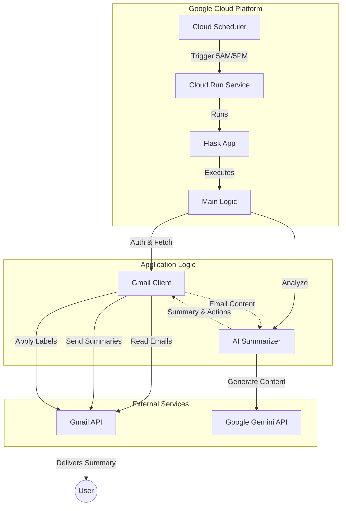

# Gmail Agent

An intelligent email assistant that automatically summarizes your unread Gmail emails using Google's Gemini AI and forwards concise summaries to your inbox.

## Features

- 🤖 **AI-Powered Summarization**: Uses Gemini 2.0 Flash to create concise email summaries
- 💡 **Section-Based Insights**: Breaks down emails into logical sections with topics and key insights
- 🎯 **Action Detection**: Automatically identifies emails requiring your attention
- 🏷️ **Auto-Labeling**: Applies Gmail labels (`ActionRequired` or `ReadLater`) based on email analysis
- 🧵 **Thread Continuity**: Summaries appear in the original email thread
- 🔍 **Smart Filtering**:
  - Skips self-sent emails
  - Filters out purchase/transactional emails (Amazon, PayPal, etc.)
  - Prevents duplicate summaries in threads
- 🔗 **Unsubscribe Detection**: Automatically extracts and includes unsubscribe links in summaries
- ☁️ **Cloud Deployment**: Runs on Google Cloud Run (Free Tier eligible)
- ⏰ **Scheduled Execution**: Automatically processes emails twice daily at 5:00 AM and 5:00 PM

## Architecture

The system is designed as a cloud-native application running on **Google Cloud Platform (GCP)**, leveraging **Google Gemini 2.0 Flash** for high-speed, cost-effective AI analysis.



### System Components

*   **Cloud Scheduler**: The "alarm clock" that triggers the system twice daily (5:00 AM/PM).
*   **Cloud Run**: The serverless compute environment that hosts and executes the agent container.
*   **Gmail Client**: The internal Python module that handles authentication, fetches emails, and constructs the summary emails.
*   **AI Summarizer**: The intelligence layer that prepares prompts for Gemini and interprets the structured JSON response.
*   **Gmail API**: Google's external service that stores your emails and physically delivers the summaries to your inbox.
*   **Gemini API**: Google's LLM service (Gemini 2.0 Flash) that performs the text analysis and summarization.

### Logic Flow

The application follows a linear execution pipeline, optimized for batch processing:

1.  **Trigger & Auth**: The Cloud Scheduler triggers the container. The app authenticates with Gmail using OAuth 2.0.
2.  **Fetch**: Retrieves the last 50 unread emails from the inbox.
3.  **Smart Filtering**:
    *   **Self-Sent**: Ignores emails sent by the user to avoid loops.
    *   **Redundancy Check**: Skips threads that have already been summarized by the agent (checks for "Fwd:" from user).
    *   **Transactional**: Detects and skips purchase receipts, shipping notifications, and invoices (e.g., from Amazon, PayPal) to focus on communication.
4.  **AI Analysis**:
    *   The **EmailSummarizer** sends the email body to **Gemini 2.0 Flash**.
    *   Gemini generates a structured JSON response containing:
        *   Concise summary.
        *   Key insights/facts.
        *   Action required status (True/False) & reason.
5.  **Action & Notification**:
    *   **Forward**: The agent forwards the original email to the user, prepending the AI summary and insights.
    *   **Label**: Applies `ActionRequired` or `ReadLater` labels to the original message for easy sorting.
6.  **Reporting**: A final execution log is sent to the user, detailing processing stats and any errors.

## Example Output

Here's how an incoming email looks when processed by the agent:

**Original Email:**
> **From:** Sarah Jones (via Project Alpha Updates) <<sarah.jones@example.com>><br>
> **Subject:** Project Alpha Update & Q4 Planning<br>
> **Body:** Hi everyone, quick update on Project Alpha. The backend API is finally complete and all tests are passing! However, we're hitting some snags with the frontend integration—specifically around the new auth flow. We likely need another 2 days to iron that out. Also, we really need to lock down the Q4 roadmap. Can we meet next Tuesday at 2 PM to go over the proposed features? Let me know if that works.<br>
>
> [You are receiving this because you are subscribed to Project Alpha Updates. Unsubscribe]

**Agent's Summary Email:**
> **Original Sender:** Sarah Jones (via Project Alpha Updates) <<sarah.jones@example.com>><br>
> **Subject:** Project Alpha Update & Q4 Planning
>
> **Summary:**<br>
> Sarah reports that the Project Alpha backend is complete, but frontend integration is delayed by ~2 days due to auth issues. She requests a Q4 planning meeting next Tuesday at 2 PM.
>
> **Insights**<br>
> ・Backend Status: API implementation is complete with passing tests.<br>
> ・Frontend Issues: Delays caused by authentication flow integration.<br>
> ・Scheduling: Requests meeting on Tuesday @ 2 PM for Q4 roadmap.<br>
>
> **Action Required**: YES<br>
> **Reason**: Needs confirmation for the proposed meeting time.
>
> **Unsubscribe Link**: [Link found in email]

As you can imagine, insights can be a lot more helpful for longer emails.

## Prerequisites

- Python 3.11+
- Google Cloud account (for deployment)
- Gmail account
- Google Cloud Project with billing enabled

## Prerequisites

1.  **Google Cloud Project**: You need a Google Cloud Project.
2.  **Gmail API Enabled**: Enable the Gmail API for your project.
3.  **OAuth Consent Screen**:
    -   Go to [OAuth consent screen](https://console.cloud.google.com/apis/credentials/consent).
    -   Set "User Type" to **External**.
    -   Fill in required fields (App name, support email).
    -   **IMPORTANT**: Under "Publishing status", click **"Publish App"** to set it to "In production". This prevents the authentication token from expiring every 7 days.
4.  **Credentials**:
    -   Go to [Credentials](https://console.cloud.google.com/apis/credentials).
    -   Click "Create Credentials" > "OAuth client ID".
    -   Application type: **Desktop app**.
    -   Name: "Gmail Agent Desktop".
    -   Click "Create" and download the JSON file.
    -   Rename it to `credentials.json` and place it in the project root.

## Setup


### 1. Clone the Repository

```bash
git clone https://github.com/henryhyunwookim/gmail-agent.git
cd gmail-agent
```

### 2. Install Dependencies

```bash
pip install -r requirements.txt
```

### 3. Set Up Gmail API

1. Go to [Google Cloud Console](https://console.cloud.google.com/)
2. Create a new project or select an existing one
3. Enable the Gmail API
4. Create OAuth 2.0 credentials (Desktop app)
5. Download `credentials.json` and place it in the project root

### 4. Set Up Gemini API

1. Go to [Google AI Studio](https://makersuite.google.com/app/apikey)
2. Create an API key
3. Copy `.env.example` to `.env`:

```bash
cp .env.example .env
```

4. Edit `.env` and add your API key and GCP configuration:

```env
GEMINI_API_KEY=your_actual_api_key

# GCP Configuration (needed for cloud deployment)
GCP_PROJECT_ID=your-gcp-project-id
GCP_REGION=us-central1
SERVICE_NAME=gmail-agent
JOB_NAME=gmail-agent-daily-trigger
SCHEDULE=0 5,17 * * *
TIMEZONE=Asia/Seoul
```

### 5. Authenticate Gmail

Run the agent locally once to authenticate:

```bash
python -m src.main
```

This will open a browser window for Gmail authentication and create `token.json`.

## Local Usage

Run the agent manually:

```bash
python -m src.main
```

This will:
- Check for unread emails (up to 50)
- Summarize them using Gemini AI with section-based insights
- Forward summaries to your email within the original thread
- Apply Gmail labels (`ActionRequired` or `ReadLater`)
- Display processing statistics

## Cloud Deployment (Google Cloud Run)

### Prerequisites

- [Google Cloud CLI](https://cloud.google.com/sdk/docs/install) installed
- Google Cloud Project with billing enabled

### Deploy

1. Ensure your `.env` file has the correct `GCP_PROJECT_ID` set

2. Run the deployment script:

```powershell
.\deploy_cloud.ps1
```

The script will:
- Build and deploy the container to Cloud Run
- Create a Cloud Scheduler job to run twice daily at 5:00 AM and 5:00 PM
- Set up all necessary permissions

### Verify Deployment

Check the logs:

```powershell
gcloud run services logs read gmail-agent --region=us-central1 --limit=50
```

Or manually trigger:

```powershell
gcloud scheduler jobs run gmail-agent-daily-trigger --location=us-central1
```

## Configuration

### Email Processing Limit

Edit `src/main.py`:

```python
messages = client.list_unread_messages(max_results=50)  # Change this number
```

### Schedule

Edit `deploy_cloud.ps1`:

```powershell
$SCHEDULE = "0 5,17 * * *"  # Cron format: daily at 5:00 AM and 5:00 PM
$TIMEZONE = "Asia/Seoul"  # Your timezone
```

### Purchase Keywords

Edit `src/summarizer.py` to customize purchase detection:

```python
purchase_keywords = [
    'order', 'purchase', 'receipt', 'invoice', 'payment',
    # Add more keywords
]
```

## Project Structure

```
gmail-agent/
├── src/
│   ├── app.py              # Flask web server for Cloud Run
│   ├── auth.py             # Gmail authentication
│   ├── debug_run.py        # Debugging utility
│   ├── gmail_client.py     # Gmail API client
│   ├── list_models.py      # Utility to list available Gemini models
│   ├── main.py             # Main application logic
│   └── summarizer.py       # AI summarization logic
├── DEPLOYMENT.md           # Detailed deployment guide
├── Dockerfile              # Container configuration
├── LICENSE                 # Project license
├── README.md               # Project documentation
├── deploy_cloud.ps1        # Cloud deployment script
├── requirements.txt        # Python dependencies
├── run_agent.bat           # Windows executable helper
├── credentials.json        # Gmail OAuth credentials (not in repo)
├── token.json             # Gmail auth token (not in repo)
└── .env                   # Environment variables (not in repo)
```

## Cost Estimate

Running twice per day on Google Cloud Run:

- **Cloud Run**: $0.00/month (within free tier - 60 runs/month vs 2M limit)
- **Cloud Scheduler**: $0.00/month (1 job vs 3 jobs free)
- **Gemini API**: $0.00/month (generous free tier)

**Total**: Free! 🎉

## Security Notes

⚠️ **Never commit these files to Git:**
- `credentials.json`
- `token.json`
- `.env`

These files contain sensitive authentication data.

## Troubleshooting

### "ModuleNotFoundError"
- Ensure `PYTHONPATH=/app` is set in `Dockerfile`
- All imports use absolute paths (`from src.module import ...`)

### "could not locate runnable browser"
- Ensure `token.json` is included in `Dockerfile`
- Run locally first to generate `token.json`

### Billing Error
- Enable billing in Google Cloud Console
- Link billing account to your project

## License

This project is licensed under a Non-Commercial License - see [LICENSE](LICENSE) file for details.

## Acknowledgments

- Powered by [Google Gemini AI](https://ai.google.dev/)
- Uses [Gmail API](https://developers.google.com/gmail/api)
