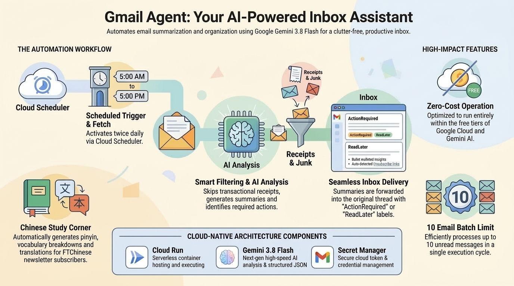
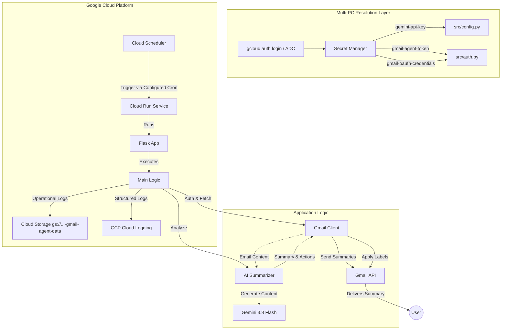

# Gmail Agent

An intelligent email assistant that automatically summarizes your unread Gmail emails using Google's Gemini AI and forwards concise summaries to your inbox.

## Features

- 🤖 **AI-Powered Summarization**: Uses Gemini 3.8 Flash to create concise email summaries
- 💡 **Section-Based Insights**: Breaks down emails into logical sections with topics and key insights
- 📚 **Chinese Study Corner**: Automatically detects emails from FTChinese and generates original text, pinyin, and vocabulary
- 🎯 **Action Detection**: Automatically identifies emails requiring your attention
- 🏷️ **Auto-Labeling**: Applies Gmail labels (`ActionRequired` or `ReadLater`)
- 🔗 **Unsubscribe Detection**: Automatically extracts unsubscribe/opt-out links for easy access
- ⚙️ **Configurable Limits & Schedule**: Easily adjust the batch size of emails to read (default: 20) and execution schedule (cron/intervals) without touching code
- ☁️ **Cloud Deployment**: Runs on Google Cloud Run (Free Tier eligible)


## Architecture

The system is designed as a fully cloud-native, multi-PC portable application running on **Google Cloud Platform (GCP)**, leveraging **Google Cloud Secret Manager**, **Google Cloud Storage (GCS)**, and **Google Gemini 3.8 Flash** for high-speed, secure, and zero-setup execution across any machine or Cloud Run.




```mermaid
graph TD
    subgraph Multi-PC Resolution Layer
        GCPAuth[gcloud auth login / ADC] --> SecretMgr[Secret Manager]
        SecretMgr -->|gemini-api-key| Config[src/config.py]
        SecretMgr -->|gmail-agent-token| Auth[src/auth.py]
        SecretMgr -->|gmail-oauth-credentials| Auth
    end

    subgraph Google Cloud Platform
        Scheduler[Cloud Scheduler] -->|Trigger via Configured Cron| CloudRun[Cloud Run Service]
        CloudRun -->|Runs| App[Flask App]
        App -->|Executes| Main[Main Logic]
        Main -->|Operational Logs| GCS[Cloud Storage gs://...-gmail-agent-data]
        Main -->|Structured Logs| CloudLogging[GCP Cloud Logging]
    end

    subgraph Application Logic
        Main -->|Auth & Fetch| GmailClient[Gmail Client]
        Main -->|Analyze| Summarizer[AI Summarizer]
        Summarizer -.->|Summary & Actions| GmailClient
        GmailClient -.->|Email Content| Summarizer
        Summarizer -->|Generate Content| GeminiAPI[Gemini 3.8 Flash]
        GmailClient -->|Send Summaries| GmailAPI[Gmail API]
        GmailClient -->|Apply Labels| GmailAPI
    end

    GmailAPI -->|Delivers Summary| User((User))
```

### Multi-PC Cloud Architecture Strategy

| Layer | Target Cloud Service | Purpose & Storage Format | Multi-PC Resolution Strategy |
| :--- | :--- | :--- | :--- |
| **API Keys & Secrets** (`GEMINI_API_KEY`) | **Google Cloud Secret Manager** | Secure string (`secrets/gemini-api-key`) | Dual-mode: Python SDK with fallback to authenticated `gcloud secrets versions access` CLI |
| **OAuth Tokens** (`token.json`) | **Google Cloud Secret Manager** | Serialized JSON token (`secrets/gmail-agent-token`) | Auto-resolved when local file is missing; in-memory refresh with OS temp cache fallback |
| **OAuth Client IDs** (`credentials.json`) | **Google Cloud Secret Manager** | Raw client secrets JSON (`secrets/gmail-oauth-credentials`) | Auto-downloaded in-memory on demand if interactive web browser login is triggered |
| **Persistent State** (`state.json`) | **Google Cloud Storage (GCS)** | `gs://<bucket>/gmail-agent/state.json` | Single source of truth; local runs write fallbacks only to OS temp dir (`tempfile.gettempdir()`) |
| **Operational & Audit Logs** (`run_log.json`) | **Google Cloud Storage & Cloud Logging** | `gs://<bucket>/gmail-agent/run_log.json` + `stdout` | Decoupled from state; streamed to Cloud Logging on Cloud Run and GCS |

### System Components

*   **Cloud Secret Manager**: Canonical vault storing `gemini-api-key`, `gmail-agent-token`, and `gmail-oauth-credentials`. Allows zero-setup execution on any computer.
*   **Cloud Storage (GCS)**: Stores decoupled execution logs (`run_log.json`) and agent state without polluting local git workspaces.
*   **Cloud Scheduler**: The configurable "alarm clock" that triggers the system according to your custom cron schedule.
*   **Cloud Run**: The serverless container compute environment hosting the agent container.
*   **Gmail Client**: The internal Python module that handles authentication, fetches unread emails, and constructs forwarded summaries.
*   **AI Summarizer**: The intelligence layer that analyzes emails with Gemini 3.8 Flash.

### Logic Flow

The application follows a linear execution pipeline, optimized for batch processing:

1.  **Trigger & Auth**: The Cloud Scheduler triggers the container (or triggered manually/locally). The app authenticates with Gmail using OAuth 2.0.
2.  **Fetch**: Retrieves unread emails from the inbox according to the configured batch limit (default: 20 emails, customizable via `MAX_EMAILS` or CLI).
3.  **Smart Filtering**:
    *   **Self-Sent**: Ignores emails sent by the user to avoid loops.
    *   **Redundancy Check**: Skips threads that have already been summarized by the agent (checks for "Fwd:" from user).
    *   **Transactional**: Detects and skips purchase receipts, shipping notifications, and invoices (e.g., from Amazon, PayPal) to focus on communication.
4.  **AI Analysis**:
    *   The **EmailSummarizer** sends the email body to **Gemini 3.8 Flash**.
    *   Gemini generates a structured JSON response containing:
        *   Concise summary.
        *   Key insights/facts.
        *   Action required status (True/False) & reason.
5.  **Action & Notification**:
    *   **Forward**: The agent forwards the original email to the user, prepending the AI summary and insights.
    *   **Unsubscribe Link**: If detected, the agent extracts the `unsubscribe`, `opt-out`, or `preferences` link and appends it to the summary for quick management.
    *   **Chinese Study Corner**: If the email is from `newsletter.ftchinese.com`, a special study section is appended with original text, pinyin, English, and vocabulary. The general summary and insights are excluded to save API resources and avoid duplicate content.
    *   **Label**: Applies `ActionRequired` or `ReadLater` labels to the original message for easy sorting.
6.  **Reporting**: A final execution log is sent to the user, detailing processing stats and any errors.

## Example Output

Here's how an incoming email looks when processed by the agent:

**Original Email:**
> **From:** Sarah Jones (via Project Alpha Updates) <<sarah.jones@example.com>><br>
> **Subject:** Project Alpha Update & Q4 Planning<br>
> **Body:** Hi everyone, quick update on Project Alpha. The backend API is finally complete and all tests are passing! However, we're hitting some snags with the frontend integration—specifically around the new auth flow. We likely need another 2 days to iron that out. Also, we really need to lock down the Q4 roadmap. Can we meet next Tuesday at 2 PM to go over the proposed features? Let me know if that works.<br>
>
> [You are receiving this because you are subscribed to Project Alpha Updates. Unsubscribe]

**Agent's Summary Email:**
> **Original Sender:** Sarah Jones (via Project Alpha Updates) <<sarah.jones@example.com>><br>
> **Subject:** Project Alpha Update & Q4 Planning
>
> **Summary:**<br>
> Sarah reports that the Project Alpha backend is complete, but frontend integration is delayed by ~2 days due to auth issues. She requests a Q4 planning meeting next Tuesday at 2 PM.
>
> **Insights**<br>
> ・Backend Status: API implementation is complete with passing tests.<br>
> ・Frontend Issues: Delays caused by authentication flow integration.<br>
> ・Scheduling: Requests meeting on Tuesday @ 2 PM for Q4 roadmap.<br>
>
> **Action Required**: YES<br>
> **Reason**: Needs confirmation for the proposed meeting time.
>
> **Unsubscribe Link**: [Link found in email]

As you can imagine, insights can be a lot more helpful for longer emails.

## 🎨 Personalization Showcase

This agent is highly customizable. While it includes built-in support for **Chinese language learning**, the same logic can be applied to any specialized newsletter, technical digest, or specific communication style.

### ✨ Example: Custom Study Materials
The agent can be configured to extract content from specific newsletters and transform them into personalized study or reference materials (e.g., custom study guides, flashcards, or NotebookLM-generated audio overviews and presentations).

---

## Prerequisites

- Python 3.11+
- Google Cloud account (for deployment)
- Gmail account
- Google Cloud Project with billing enabled

1.  **Google Cloud Project**: You need a Google Cloud Project.
2.  **Gmail API Enabled**: Enable the Gmail API for your project.
3.  **OAuth Consent Screen**:
    -   Go to [OAuth consent screen](https://console.cloud.google.com/apis/credentials/consent).
    -   Set "User Type" to **External**.
    -   Fill in required fields (App name, support email).
    -   **IMPORTANT**: Under "Publishing status", click **"Publish App"** to set it to "In production". This prevents the authentication token from expiring every 7 days.
4.  **Credentials**:
    -   Go to [Credentials](https://console.cloud.google.com/apis/credentials).
    -   Click "Create Credentials" > "OAuth client ID".
    -   Application type: **Desktop app**.
    -   Name: "Gmail Agent Desktop".
    -   Click "Create" and download the JSON file.
    -   Rename it to `credentials.json` and place it in the project root.

## Setup


### 1. Clone the Repository

```bash
git clone https://github.com/henryhyunwookim/gmail-agent.git
cd gmail-agent
```

### 2. Install Dependencies

```bash
pip install -r requirements.txt
```

### 3. Set Up Gmail API

1. Go to [Google Cloud Console](https://console.cloud.google.com/)
2. Create a new project or select an existing one
3. **IMPORTANT**: Enable the **Gmail API** and **Generative Language API** for your project in the [API Library](https://console.cloud.google.com/apis/library).
4. Create OAuth 2.0 credentials (Desktop app)
5. Download `credentials.json` and place it in the project root

### 4. Set Up Gemini API

1. Go to [Google AI Studio](https://makersuite.google.com/app/apikey)
2. Create an API key
3. Copy `.env.example` to `.env`:

```bash
cp .env.example .env
```

4. Edit `.env` and add your API key and GCP configuration:

```env
GEMINI_API_KEY=your_actual_api_key

# Email Processing Configuration
MAX_EMAILS=20

# GCP Configuration (needed for cloud deployment)
GCP_PROJECT_ID=your-gcp-project-id
GCP_REGION=us-central1
SERVICE_NAME=gmail-agent
JOB_NAME=gmail-agent-daily-trigger
SCHEDULE=0 5,17 * * *
TIMEZONE=Asia/Seoul
```

### 5. Authenticate Gmail

Run the debug script locally once to authenticate and verify your setup:

```bash
python tests/debug_run.py
```

This will open a browser window for Gmail authentication and create `token.json`. It also verifies that both Gmail and Gemini APIs are correctly configured.

## Local Usage

Run the agent manually:

```bash
python -m src.main
```

Or specify a custom email batch limit via CLI flag:

```bash
python -m src.main --max-emails 20
```

Or run continuously on a recurring interval (e.g. every 30 minutes):

```bash
python -m src.main --interval 30
```

This will:
- Check for unread emails (up to `MAX_EMAILS`, default: 20)
- Summarize them using Gemini AI with section-based insights
- Forward summaries to your email within the original thread
- Apply Gmail labels (`ActionRequired` or `ReadLater`)
- Display processing statistics

## Cloud Deployment (Google Cloud Run)

### Prerequisites

- [Google Cloud CLI](https://cloud.google.com/sdk/docs/install) installed
- Google Cloud Project with billing enabled

### Deploy

1. Ensure your `.env` file has the correct `GCP_PROJECT_ID` set

2. Run the deployment script:

```powershell
.\deploy_cloud.ps1
```

The script will:
- Build and deploy the container to Cloud Run
- Create a Cloud Scheduler job to run twice daily at 5:00 AM and 5:00 PM
- Set up all necessary permissions

### Verify Deployment

Check the logs:

```powershell
gcloud run services logs read gmail-agent --region=us-central1 --limit=10
```

Or manually trigger:

```powershell
gcloud scheduler jobs run gmail-agent-daily-trigger --location=us-central1
```

## Configuration

All primary behaviors can be configured without modifying source code by updating your `.env` file or providing command-line arguments.

### Email Processing Limit (Batch Size)

You can easily configure the maximum number of unread emails fetched and summarized per run:

- **Via Environment Variable** (applies to both local runs and Cloud Run):
  Set `MAX_EMAILS` in your `.env` file:
  ```env
  # Process up to 20 unread emails per execution cycle (default: 20)
  MAX_EMAILS=20
  ```

- **Via Command-Line Argument** (local manual runs):
  Pass `-n` or `--max-emails` directly to the script:
  ```bash
  python -m src.main --max-emails 25
  ```

- **Via HTTP Trigger** (Cloud Run endpoint):
  Pass `max_emails` as a URL query parameter or in a JSON body:
  ```bash
  curl -X POST "https://<SERVICE_URL>/?max_emails=20"
  ```

### Schedule & Frequency (When and How Often to Run)

The execution timing and frequency can be tailored to your preference:

#### 1. Cloud Deployment (Cloud Scheduler)
Configure `SCHEDULE` and `TIMEZONE` in your `.env` file before running `.\deploy_cloud.ps1`. The deployment script will automatically configure or update the Cloud Scheduler job:

```env
# Standard 5-field cron syntax: (minute hour day-of-month month day-of-week)
SCHEDULE=0 5,17 * * *
TIMEZONE=Asia/Seoul
```

Common schedule patterns:
| Frequency | Cron Expression (`SCHEDULE`) | Description |
| :--- | :--- | :--- |
| **Twice daily (Default)** | `0 5,17 * * *` | Runs at 5:00 AM and 5:00 PM every day |
| **Once daily** | `0 8 * * *` | Runs every morning at 8:00 AM |
| **Hourly** | `0 * * * *` | Runs at the beginning of every hour |
| **Every 30 minutes** | `*/30 * * * *` | Runs every 30 minutes |
| **Weekdays only** | `0 9 * * 1-5` | Runs Monday through Friday at 9:00 AM |

> **Updating Schedule**: If you want to change the schedule after deploying, simply adjust `SCHEDULE` in `.env` and rerun `.\deploy_cloud.ps1`. Cloud Scheduler will be updated immediately.

#### 2. Local Deployment (Windows Task Scheduler)
If you run the agent on your Windows computer using Task Scheduler:
1. Open Task Scheduler (`taskschd.msc`).
2. Select your `Gmail Agent` task and click **Properties** > **Triggers** tab.
3. Edit the trigger to set your preferred interval (e.g., daily at specific hours, or repeat every 15/30/60 minutes).

### Purchase Keywords

Edit `src/summarizer.py` to customize purchase detection:

```python
purchase_keywords = [
    'order', 'purchase', 'receipt', 'invoice', 'payment',
    # Add more keywords
]
```

## Multi-PC Zero-Setup Execution

In this cloud-native architecture, any newly cloned machine with `gcloud` access can execute immediately with **zero local credential files** or `.env` required.

```powershell
# 1. Authenticate with Google Cloud
gcloud auth login
gcloud config set project gen-lang-client-0480639565

# 2. Run immediately in Dry-Run mode (zero files created on disk)
python -m src.main --dry-run --max-emails 2

# 3. Normal execution
python -m src.main --max-emails 20
```

### Initial Credential Synchronization (One-Time Setup)

If you generate or obtain new local credentials and need to seed Secret Manager:

```powershell
# Sync token.json, credentials.json, and GEMINI_API_KEY to Secret Manager in one shot
python sync_secrets.py
```

## Project Structure

```
gmail-agent/
├── deployment/
│   ├── .env.example        # Reference template for cloud variables (optional locally)
│   ├── DEPLOYMENT.md       # Detailed deployment guide
│   ├── deploy_cloud.ps1    # Cloud deployment script (Cloud Run + Scheduler)
│   ├── sync_secrets.py     # Tool to sync local credentials to Secret Manager
│   └── upload_token.ps1    # Token upload utility
├── docs/
│   └── assets/             # Architecture overview & documentation assets
├── src/
│   ├── app.py              # Flask web server for Cloud Run
│   ├── auth.py             # Dual-mode multi-PC Gmail authentication
│   ├── config.py           # Centralized configuration & Secret Manager resolution
│   ├── gmail_client.py     # Gmail API client
│   ├── main.py             # Main application logic & CLI runner
│   ├── storage.py          # Google Cloud Storage state & decoupled run logging
│   └── summarizer.py       # AI summarization logic (Gemini 3.8 Flash)
├── sync_secrets.py         # Convenience CLI entry point for secret synchronization
├── Dockerfile              # Container configuration
├── LICENSE                 # Project license
├── README.md               # Project documentation
├── requirements.txt        # Python dependencies (includes cloud secret & storage SDKs)
└── run_agent.bat           # Windows executable helper
```

## Cost Estimate

Running twice per day on Google Cloud Run:

- **Cloud Run (Compute)**: $0.00/month (within free tier — ~60 runs/month vs. 2M free requests limit).
- **Cloud Scheduler**: $0.00/month (1 job configured vs. 3 free jobs allowance per billing account).
- **Gemini API**: $0.00/month (Google AI Studio free tier for Gemini Flash models).
- **Auxiliary Services (Storage & Egress)**: ~$0.05 – $0.10/month (~0.3 JPY / day):
  - *Artifact Registry*: Stores the Docker container image (0.5 GB/month is free; excess image storage is billed at ~$0.10/GB/month).
  - *Network Egress*: Minor cross-region data transfer fees when calling Gmail and Gemini APIs.
  - *Secret Manager* (if used): 6 active secret versions are free per month.

**Total**: **Essentially free** (~$0.05 – $0.10/month or ~10 JPY/month).

> **Tip**: For a completely $0.00 setup without any cloud infrastructure or storage fees, run the agent locally via Windows Task Scheduler (see [Option 1 in DEPLOYMENT.md](deployment/DEPLOYMENT.md)).

## Security Notes

⚠️ **Never commit these files to Git:**
- `credentials.json`
- `token.json`
- `.env`

These files contain sensitive authentication data.

## Troubleshooting

### "ModuleNotFoundError"
- Ensure `PYTHONPATH=/app` is set in `Dockerfile`
- All imports use absolute paths (`from src.module import ...`)

### "could not locate runnable browser"
- Ensure `token.json` is included in `Dockerfile`
- Run locally first to generate `token.json`

### "Error 403: access_denied" (OAuth Blocked)
- Ensure your email is added to the **Test Users** list in the [OAuth consent screen](https://console.cloud.google.com/apis/credentials/consent) settings.
- If the app is in "Testing" mode, only approved users can log in.

### "Gmail API has not been used... or it is disabled"
- Click the link provided in the error message to enable the Gmail API for your project in the Google Cloud Console.

### Billing Error
- Enable billing in Google Cloud Console
- Link billing account to your project

## License

This project is licensed under a Non-Commercial License - see [LICENSE](LICENSE) file for details.

## Acknowledgments

- Powered by [Google Gemini AI](https://ai.google.dev/)
- Uses [Gmail API](https://developers.google.com/gmail/api)
